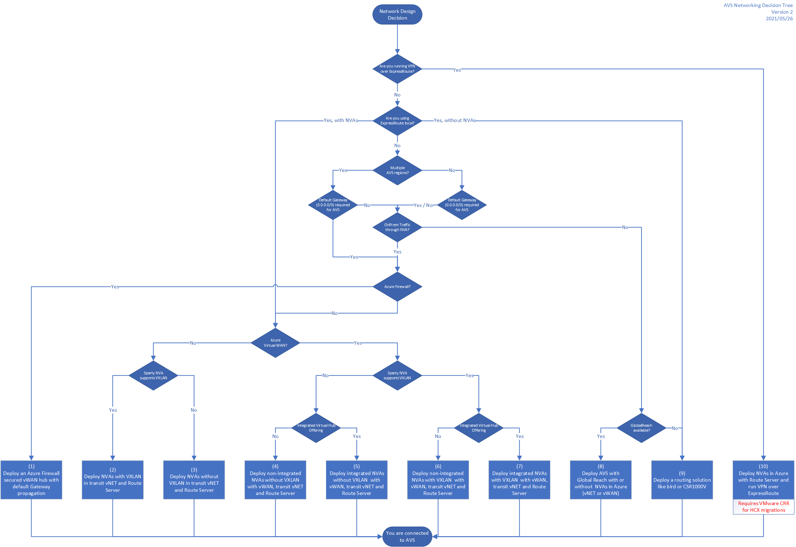

# Connecting from On Premises to Azure VMware Solution

## Intro

Azure VMware Soltuion is physical hardware running in Azure datacenters managed by Microsoft.

To connect physical components to the Azure backbone we are using a technology called ExpressRoute.

Learn more about ExpressRoute [here](https://docs.microsoft.com/en-us/azure/expressroute/expressroute-introduction).

As the Virtual Network Gateways connected to an ExpressRoute circuit can't transit traffic between two circuits (one circuit is going to on premisis, one is going to Azure VMware Solution) Microsoft uses the Global Reach feature to directly connect the on premisis circuit to AVS.
To learn more about Global Reach click [here](https://docs.microsoft.com/en-us/azure/expressroute/expressroute-global-reach).

In certain cases the Global Reach feature is not available in all regions. Please look [here](https://docs.microsoft.com/en-us/azure/expressroute/expressroute-global-reach#availability) to see where Global Reach is available.

A new product is [Azure Route Server](https://docs.microsoft.com/en-us/azure/route-server/overview), it enables BGP connections with 3rdparty devices to exchange routes between Azure infrastructure components and appliances.

This guide should help you decide on the best possible network architecure for you.

---

## Azure VMware Solution Network Decision Tree

The decision tree helps you select the right network design.
It is important that you think about the possible scenarios, that should be achieved using AVS.

One common use case is e.g. sending traffic through an NVA or propagate a default route to AVS for outbound internet traffic.

You can also download a PDF [here](avs-network-decision-tree.pdf)

---

### Reference architectures

The reference architectures will be described on separate pages

  1. [Deploy an Azure Firewall in a secured vWAN hub with Default Gateway propagation](deploy-an-azure-firewall-in-a-secured-vwan-hub-with-default-gateway-propagation) (coming soon)
  2. [Deploy NVA with VXLAN in transit vNET and Route Server](deploy-nva-with-vxlan-in-transit-vnet-and-route-server)
  3. [Deploy NVA without VXLAN in transit vNET and Route Server](deploy-nva-without-vxlan-in-transit-vnet-and-route-server) (coming soon)
  4. [Deploy non-integrated NVAs without VXLAN in vWAN with transit vNET and Route Server](deploy-non-integrated-nvas-without-vxlan-in-vwan-with-transit-vnet-and-route-server)
  5. [Deploy integrated NVAs without VXLAN in vWAN with transit vNET and Route Server](deploy-integrated-nvas-without-vxlan-in-vwan-with-transit-vnet-and-route-server) (coming soon)
  6. [Deploy non-integrated NVAs with VXLAN in vWAN with transit vNET and Route Server](deploy-non-integrated-nvas-with-vxlan-in-vwan-with-transit-vnet-and-route-server) (coming soon)
  7. [Deploy integrated NVAs with VXLAN in vWAN with transit vNET and Route Server](deploy-integrated-nvas-with-vxlan-in-vwan-with-transit-vnet-and-route-server) (coming soon)
  8. [Deploy AVS with Global Reach with or without NVAs in Azure (vNET or vWAN)](deploy-avs-with-global-reach-with-or-without-nvas-in-azure-vnet-or-vwan)
  9. Deploy a routing solution like bird or CSR1000V

      * [Deploy a Routing solution using BIRD](deploy-routing-bird)
      * [Deploy a Routing solution using Cisco CSR1000V](deploy-routing-csr1000v)
  
  10. [Deploy NVA in Azure with Route Server and run VPN over ExpressRoute](deploy-nva-in-azure-with-route-server-and-vpn-over-expressroute)
